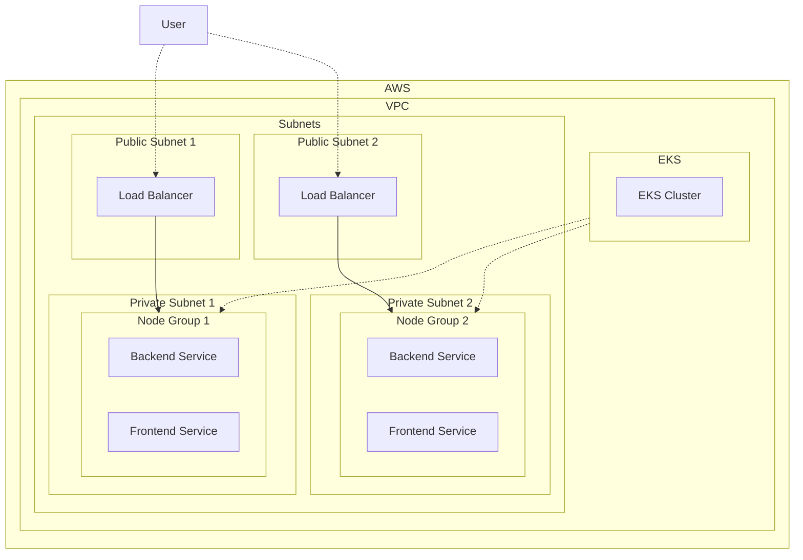

# Infrastructure Diagram

```mermaid
graph TD;
    User -.-> LoadBalancer1
    User -.-> LoadBalancer2
    subgraph AWS
        subgraph VPC[VPC]
            subgraph EKS
                Cluster[EKS Cluster]
            end
            subgraph Subnets
                subgraph Public1[Public Subnet 1]
                    LoadBalancer1[Load Balancer]
                end
                subgraph Public2[Public Subnet 2]
                    LoadBalancer2[Load Balancer]
                end
                subgraph Private1[Private Subnet 1]
                    subgraph NodeGroup1[Node Group 1]
                        Backend1[Backend Service]
                        Frontend1[Frontend Service]
                    end
                end
                subgraph Private2[Private Subnet 2]
                    subgraph NodeGroup2[Node Group 2]
                        Backend2[Backend Service]
                        Frontend2[Frontend Service]
                    end
                end
            end
        end
    end
    EKS -.-> NodeGroup1
    EKS -.-> NodeGroup2
    LoadBalancer1 --> NodeGroup1
    LoadBalancer2 --> NodeGroup2
```
